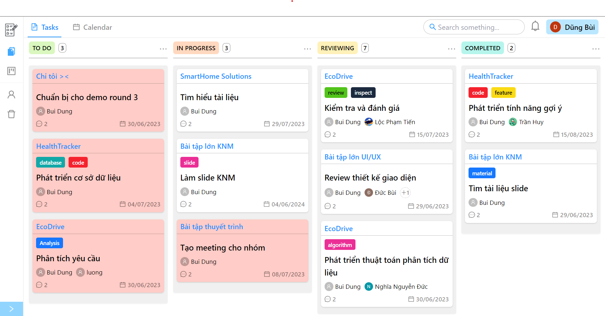

<p align="center">
  <p>
    
  </p>

  <p>
    <a href="https://reactjs.org/"></a><!--
    --><a href="https://ant.design/"></a><!--
    --><a href="https://firebase.google.com/"></a>
  </p>
</p>

## What is UniTasks ?

A task management web application for HUST UI/UX course

<p>
  
</p>

## Table of Contents

- [Getting Started](#getting-started)
- [Setup and Configuration](#setup-and-configuration)
- [Usage](#usage)
- [License](#license)

## Getting Started

Live demo: [UniTasks](https://unitasks.vercel.app)

To get a local copy of the project up and running, follow these steps:

1. Clone the repository: `git@github.com:Thdeathz/UniTasks.git`
2. Navigate to the project directory: `cd UniTasks`
3. Install the dependencies: `yarn`

## Setup and Configuration

Before running the application, you need to set up a Firebase project and configure the necessary environment variables. Follow these steps:

1. Create a Firebase project at [https://console.firebase.google.com](https://console.firebase.google.com)
2. Enable the `Firestore database`, `Authentication`, `Storage` for the project
3. Obtain the Firebase configuration values (API key, database URL, etc.)
4. Create a `.env` file in the project root directory
5. Add the following environment variables to the `.env` file:

```bash
VITE_FIREBASE_APP_ID=
VITE_FIREBASE_API_KEY=
VITE_FIREBASE_AUTH_DOMAIN=
VITE_FIREBASE_PROJECT_ID=
VITE_FIREBASE_STORAGE_BUCKET=
VITE_FIREBASE_MESSAGE_SENDER_ID=
VITE_FIREBASE_MEASUREMENT_ID=
```

6. Save the `.env` file

## Usage

To start the application locally, use the following command:

```bash
yarn dev
```

The application will be accessible at [http://localhost:3000](http://localhost:3000)

## License

This project is licensed under the [MIT License](LICENSE).
